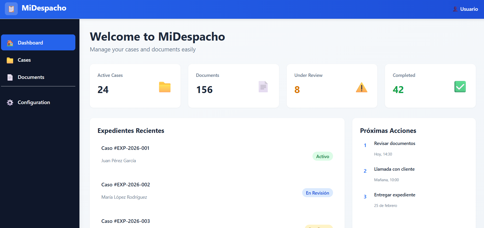
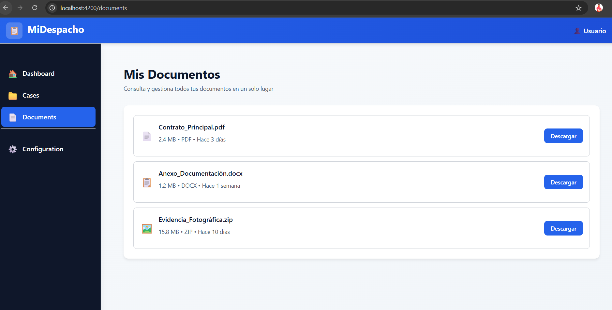
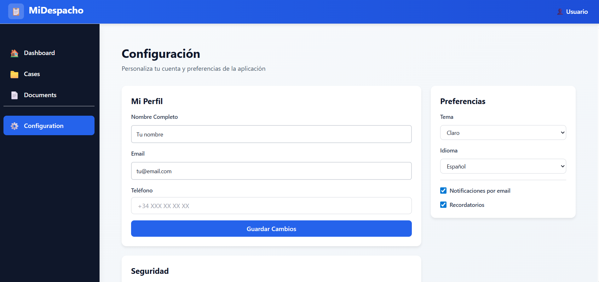

# 📋 MiDespacho - Frontend

> **Modern law case management | Modern law office management platform**

---

## ✨ Premium Case Management Application

MiDespacho is a **comprehensive solution** for lawyers and law offices, built with the latest web technology.

| Aspect | Features |
|--------|----------|
| 🎯 **Interface** | Modern, intuitive and responsive |
| 📱 **Compatible** | Desktop, Tablet, Mobile |
| ⚡ **Performance** | Ultra fast and optimized |
| 🔒 **Security** | TypeScript strict mode |
| 🎨 **Design** | Tailwind CSS + Custom SCSS |

---

## 🏗️ Tech Stack

```
┌─────────────────────────────────────┐
│   📦 Angular 21.1.0 Standalone     │
├─────────────────────────────────────┤
│ • TypeScript 5.9.2 (Strict Mode)   │
│ • Signals - State Management       │
│ • Tailwind CSS + SCSS              │
│ • Vitest + TestBed (Testing)       │
│ • Angular CLI 21.1.4               │
└─────────────────────────────────────┘
```

## 🚀 Quick Start

### 📋 Prerequisites

```bash
Node.js 22.10.7+ | npm 10.9.3+ | Angular CLI 21.1.4 (optional)
```

### 💾 Installation

```bash
# Clone and navigate to the directory
cd MiDespacho-frontend

# Install dependencies
npm install

# Done! ✅
```

### ⚡ Main Commands

```bash
# 🔥 Development server (port 4200)
npm run start

# 📦 Build for production
npm run build

# 👁️  Watch mode
npm run watch

# 🧪 Unit tests
npm run test

# 📊 Tests with coverage
npm run test:cov

# 🌐 E2E tests
npm run test:e2e
```

---

## 📸 Screenshots

### 🏠 Main Dashboard
Screenshot of the home page with statistics and recent cases



**Features displayed:**
- 📊 Real-time statistics (24 active cases, 156 documents)
- ✅ Recent case files with status
- 🕒 Upcoming actions and pending tasks
- 📈 Productivity metrics

---

### 📁 Case File Management
Complete case file view with filters and search



**Features displayed:**
- 🔍 Advanced search and filters
- 📋 Complete list of active cases
- 🏷️ Case file statuses
- ➕ Create new cases
- 📂 Organization by folders

---

### 📄 Document Manager
Complete document organization by categories


**Features displayed:**
- 📁 Organization by categories
- 🔗 Link documents to case files
- 📤 Upload new documents
- 📥 Download and share
- 🏷️ Smart tagging
- 🔐 Permission control

---

### ⚙️ Configuration
Complete customization of preferences and parameters



**Available options:**
- 👤 User and profile management
- 🏢 Office configuration
- 🔒 Security and authentication
- 🔔 Notifications and alerts
- 🎨 Themes (Light/Dark)
- 📤 Import/Export data
- 🌐 Integrations with external systems

---

## 🎨 User Interface

### 🎯 Main Features

✨ **Standalone Components** - No NgModule dependencies
🎪 **Modern Control Flow** - `@if`, `@for`, `@switch`
📊 **Reactive State** - Angular Signals
🔄 **OnPush Change Detection** - Optimized performance
📱 **Responsive Design** - Works on any device

### 🎨 Color Palette

```css
🔵 Primary:      #2563EB (Blue)
⚪ Secondary:    #F3F4F6 (Light Gray)
⬛ Dark:         #1F2937 (Dark Gray)
🟢 Success:      #10B981 (Green)
🟠 Warning:      #F59E0B (Orange)
🔴 Error:        #EF4444 (Red)
```

---

## 🏗️ Architecture

### 📂 Folder Structure

```
src/app/
├── 🎯 app.config.ts           # Global configuration
├── 🛣️  app.routes.ts           # Routing
├── 📦 app.ts                   # Root component
│
├── 🧩 components/             # Reusable components
│   ├── dashboard/             # Main panel
│   ├── expedient-detail/      # Case detail
│   ├── document-set-list/     # Documents listing
│   ├── configuration/         # Configuration
│   ├── header/                # Header
│   ├── sidebar/               # Sidebar menu
│   └── ...more components
│
├── 🔧 services/               # Shared services
│   ├── expedient.service.ts
│   └── document.service.ts
│
└── 📋 models/                 # TypeScript interfaces
    ├── expedient.model.ts
    └── document.model.ts
```

### 🔄 Main Patterns

#### 1️⃣ Signals for State

```typescript
// Simple reactive states
protected readonly count = signal(0);
protected readonly isLoading = signal(false);

// Computed states
protected readonly doubleCount = computed(() => this.count() * 2);

// Side effects
effect(() => {
  console.log('Change detected:', this.count());
});
```

#### 2️⃣ Dependency Injection

```typescript
@Injectable({ providedIn: 'root' })
export class ExpedientService {
  constructor(private http: HttpClient) {}
}

@Component({...})
export class MyComponent {
  constructor(private expedientService: ExpedientService) {}
}
```

#### 3️⃣ Modern Control Flow

```html
<!-- Conditionals -->
@if (isLoading()) {
  <p>Loading...</p>
}

<!-- Iterations -->
@for (case of cases(); track case.id) {
  <div>{{ case.name }}</div>
}

<!-- Switch -->
@switch (status()) {
  @case ('active') { <span>✅ Active</span> }
  @case ('review') { <span>⏳ Under Review</span> }
  @default { <span>❓ Unknown</span> }
}
```

#### 4️⃣ OnPush Change Detection

```typescript
@Component({
  selector: 'app-card',
  standalone: true,
  changeDetection: ChangeDetectionStrategy.OnPush,
  template: '...'
})
export class CardComponent {
  @Input() data: any;
  // More efficient with Signals
}
```

---

## 🛣️ Main Routes

| Route | Component | Description |
|-------|-----------|-------------|
| `/` | Dashboard | Main panel |
| `/expedients` | MyExpedientsComponent | Cases listing |
| `/expedients/:id` | ExpedientDetailComponent | Case detail |
| `/documents` | DocumentsComponent | Document manager |
| `/configuration` | ConfigurationComponent | Configuration |

---

## 🎨 Styles and Themes

### Tailwind CSS + SCSS

- ✅ **Tailwind CSS** - Modern CSS utilities
- ✅ **SCSS** - Custom component styles
- ✅ **CSS Variables** - Dynamic themes
- ✅ **Prettier** - Automatic formatting

```bash
npm run lint    # Check issues
npm run format  # Format code
```

---

## 🌐 Backend Integration

The application connects to the Backend API (default port 3000):

```typescript
// In ExpedientService
export class ExpedientService {
  constructor(private http: HttpClient) {}

  getExpedientes() {
    return this.http.get('/api/expedientes');
  }

  createExpediente(data: CreateExpedientDTO) {
    return this.http.post('/api/expedientes', data);
  }

  updateExpediente(id: string, data: UpdateExpedientDTO) {
    return this.http.put(`/api/expedientes/${id}`, data);
  }

  deleteExpediente(id: string) {
    return this.http.delete(`/api/expedientes/${id}`);
  }
}
```

Configure the base URL in `src/app/app.config.ts` if needed.

---

## 🚀 Code Generation

Use Angular CLI to generate components and structures:

```bash
# 🧩 New standalone component
ng generate component components/my-component

# 🔧 New service
ng generate service services/my-service

# 📌 New directive
ng generate directive directives/my-directive

# 📖 View all options
ng generate --help
```

---

## 📊 Build Configuration

### Size Limits

```json
{
  "initialBudget": "500KB",
  "componentStyles": "4KB"
}
```

Configurable in `angular.json` → `architects.build.configurations.production.budgets`

### Source Maps

```
Development:  ✅ Enabled
Production:   ❌ Disabled (reduce size)
```

---

## 🔍 Linting and Formatting

### Check Issues

```bash
npm run lint
```

### Format Code

```bash
npm run format
```

**Configuration:**
- **ESLint:** `eslint.config.mjs`
- **Prettier:** Automatically formats SCSS and HTML

---

## 📦 Optimized Build

```bash
npm run build
```

Generates optimized files in `dist/mi-despacho/`:

✨ **Optimizations:**
- ✅ Hash in filenames (cache busting)
- ✅ Tree-shaking of unused code
- ✅ Minification and compression
- ✅ Route lazy loading
- ✅ Smart bundling

---

## 🌥️ Deployment

### Hosting Options

```
🚀 Netlify     → Connect repository → Auto deploy
🚀 Vercel      → Zero-config deployment
🚀 GitHub Pages → Free static hosting
🚀 AWS S3      → CloudFront CDN
🚀 Google Cloud → Cloud Storage + CDN
🚀 Azure       → Static Web Apps
```

### Nginx Configuration (SPA)

```nginx
server {
  listen 80;
  server_name example.com;

  root /var/www/html;
  index index.html;

  location / {
    try_files $uri $uri/ /index.html;
  }

  # Cache busting for hash files
  location ~* \.(js|css)$ {
    expires 1y;
    add_header Cache-Control "public, immutable";
  }
}
```

---

## 📱 Quick Useful Commands

```bash
# Quick development
npm run start

# Build and serve
npm run build && npm run preview

# Tests with watch
npm run test -- --watch

# Clean and reinstall
npm run clean && npm install

# Bundle analysis
ng analyze

# Update Angular
ng update @angular/core @angular/cli
```

---

## 🐛 Troubleshooting

### ❌ Port 4200 in use

```bash
ng serve --port 4300
```

### ❌ Module errors

```bash
rm -rf node_modules package-lock.json
npm install
npm run build
```

### ❌ Tests failing

```bash
npm run test -- --no-coverage --watch=false
```

### ❌ CORS error

Check the configuration in `app.config.ts`:

```typescript
export const appConfig: ApplicationConfig = {
  providers: [
    provideHttpClient(
      withInterceptors([...]),
      withXsrfConfiguration({
        cookieName: 'XSRF-TOKEN',
        headerName: 'X-XSRF-TOKEN',
      }),
    ),
  ],
};
```

---

## 📚 Additional Documentation

| Resource | Link |
|----------|------|
| 📖 Official Angular | https://angular.dev |
| 🎨 Tailwind CSS | https://tailwindcss.com |
| 🧪 Vitest | https://vitest.dev |
| TypeScript | https://www.typescriptlang.org |
| SCSS | https://sass-lang.com |

---

## 🤝 Contributing

1. Fork the repository
2. Create a branch (`git checkout -b feature/AmazingFeature`)
3. Commit changes (`git commit -m 'Add AmazingFeature'`)
4. Push to the branch (`git push origin feature/AmazingFeature`)
5. Open a Pull Request

---

## 📄 License

📝 **MIT License** - Free for commercial and personal use
